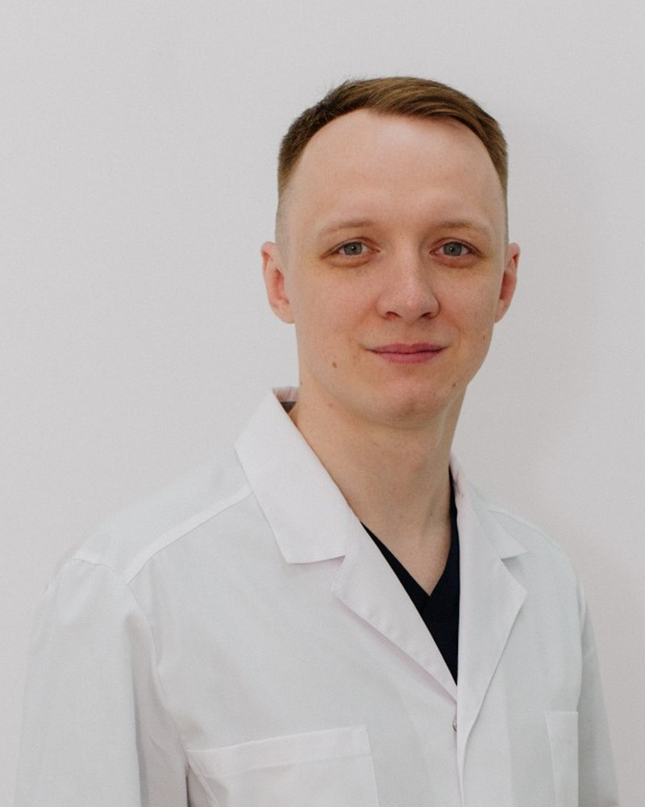

# Сайт-визитка DocBratus — инструкция по запуску

Одностраничный лендинг врача-реабилитолога Братуся М.А. Чистый HTML + CSS + JS
в одном файле (`index.html`), без сборки и внешних зависимостей кроме Google Fonts.

## Локальный просмотр

Просто откройте `site/index.html` в браузере двойным кликом.

Либо поднимите локальный сервер (чтобы корректно работали якоря и шрифты):

```bash
cd site
python3 -m http.server 8080
# затем откройте http://localhost:8080
```

## Публикация на GitHub Pages

1. Запушьте репозиторий на GitHub.
2. **Settings → Pages → Build and deployment**.
3. Source: **Deploy from a branch**.
4. Branch: ваша ветка, папка `/site` (если опции `/site` нет — выберите
   `/root` и положите `index.html` в корень, либо настройте через GitHub Actions).
5. Сохраните — через 1–2 минуты сайт будет доступен по адресу
   `https://<username>.github.io/<repo>/`.

## Публикация на Netlify

1. Зайдите на [netlify.com](https://www.netlify.com) → **Add new site → Import from Git**.
2. Выберите репозиторий.
3. **Build command:** оставьте пустым. **Publish directory:** `site`.
4. Deploy. Сайт получит адрес вида `https://<name>.netlify.app`.

## Подключение домена (bratus-doctor.ru)

- **Netlify:** Domain settings → Add custom domain → пропишите DNS-записи
  (A / CNAME) у регистратора домена.
- **GitHub Pages:** Settings → Pages → Custom domain → добавьте домен и
  CNAME-запись у регистратора. Файл `CNAME` создастся автоматически.

## Что осталось вставить (плейсхолдеры в коде)

- [ ] **Фото врача** — блок `.hero-photo` (сейчас заглушка-иконка).
- [ ] **Реальные фото До/После** — блоки `.result-photo` (6 карточек × 2 фото).
- [ ] (опц.) **Яндекс.Метрика** — вставить счётчик перед `</head>`.
- [ ] (опц.) Подключить домен `bratus-doctor.ru`.

Контакты (телефон `+7 965 761-65-43`, Telegram `@Doc_Bratus`, MAX-ссылка) уже
проставлены по данным из документации.

## Как заменить плейсхолдеры фото

В `index.html` найдите нужный блок и замените содержимое на ``:

```html
<!-- Фото врача в hero -->
<div class="hero-photo">
  
  <div class="float-card">...</div>
</div>
```

```html
<!-- Фото До/После в карточке результата -->
<div class="result-photo before"><span class="tag">Было</span>
  
</div>
```
